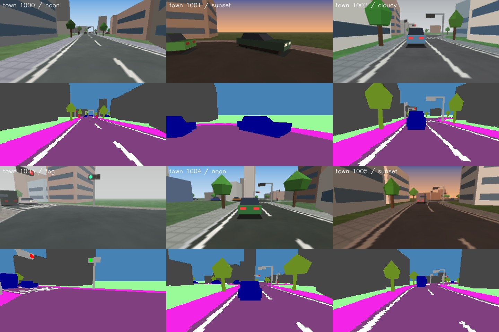
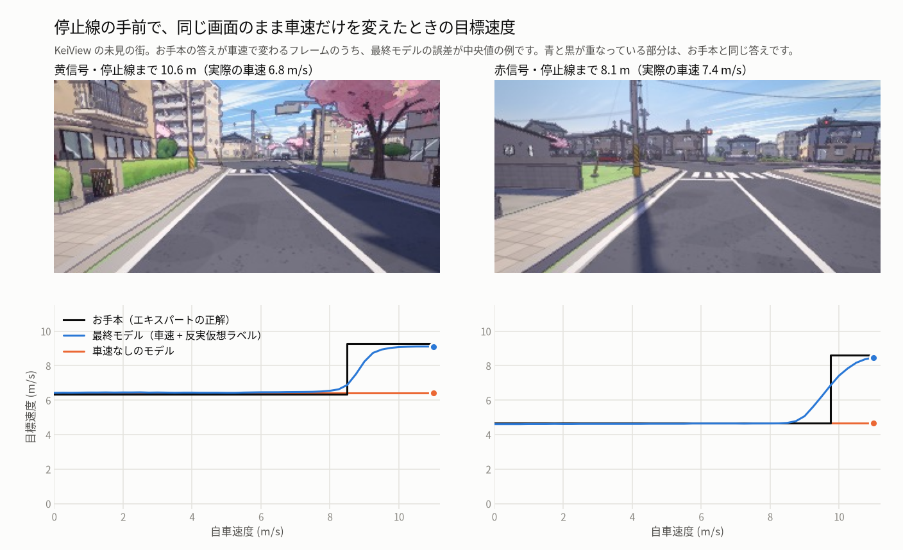
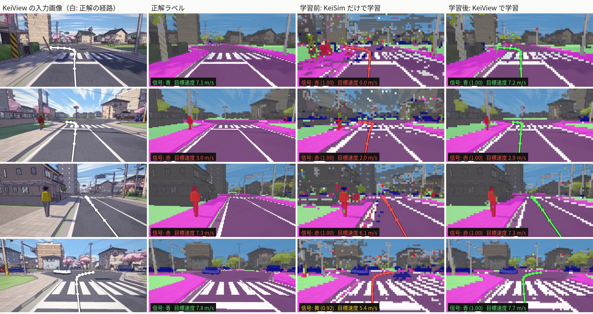

# KeiSim + KeiPilot — 軽量クローズドループ自動運転環境

**軽 (Kei) = light.** ゲームエンジンを使わず `numpy + OpenCV + PyTorch` だけで動く、
「**シミュレータ × 軽量 E2E モデル**」を最初から一体で設計したクローズドループ環境です。

> **English summary** — KeiSim is a procedurally generated, Japan-style (left-hand traffic) driving simulator
> written in plain numpy + OpenCV (no game engine, no GPU needed; ~30× real time without rendering).
> KeiPilot is a 15M-parameter end-to-end driving model (one camera frame + ego speed), trained inside KeiSim by
> imitating a privileged expert, plus DAgger. The expert's plan depends on the ego speed only at traffic lights, so
> recorded frames are relabelled for counterfactual speeds; this is what makes the model actually use its speed input.
> The same towns can also be rendered by KeiView, an anime cel-shaded three.js renderer in `web/`.
> KeiPilot v0.5 scores Driving Score 1.000 on every 600 m suite in KeiSim (80 routes, no infraction) and
> 1.000 / 0.953 / 0.995 in KeiView (unseen towns A / B / dense traffic). On 190 km of long routes with dense
> traffic it made no traffic-light mistake (v0.2: 5); three model failures remain (two pedestrian contacts, one
> low-speed bump in a queue). It also drives in the browser, with no install:
> <https://southern-star.github.io/keisim/?pilot=1> (onnxruntime-web on WebGPU, or WASM).
> Quick start: `bash setup.sh`, download `keipilot.pt` from Release v0.5.0, then
> `uv run scripts/demo.py --agent model --ckpt runs/keipilot.pt --show`.



**ブラウザで試す**: <https://southern-star.github.io/keisim/?pilot=1>
KeiPilot がブラウザの中で KeiView の街を運転します。インストールは不要で、推論は onnxruntime-web（WebGPU、なければ WASM）です。
次の交差点で曲がる方向は ← ↑ → で指定できます（[web/README.md](web/README.md#ブラウザで-keipilot-を走らせるパイロットモード)）。

| | CARLA | MetaDrive + 既存モデル | **KeiSim + KeiPilot** |
|---|---|---|---|
| 依存 | UE4, GPU 必須, 数十 GB | Panda3D | numpy / OpenCV / PyTorch のみ |
| 起動 | 数十秒〜 | 数秒 | 街生成 0.14 s + テクスチャ 0.73 s |
| 速度 (1 プロセス, i5-10400F) | ≲ 実時間 | 高速 | 描画なし **24.6×** 実時間 / カメラ込み **10.8×** |
| 認識のドメインギャップ | 小 (ただし重い) | **大 (既存モデルが見えない)** | **ゼロ: 同じ世界で学習する** |
| クローズドループ評価 | ○ | ○ | ○ (DS/RC/IS, 違反ログ, 動画, 決定論的リプレイ) |

---

## 1. 何が問題で、どう解いたか

* CARLA は重い（UE4・GPU・巨大アセット・client/server 同期）。
* MetaDrive は軽いが、実データや CARLA で学習したモデルからすると
  **描画の分布が違う (ドメインギャップ)** ため、車も信号も「認識されない」。

→ **見た目をリアルに寄せる競争をやめ、シミュレータとモデルをセットで設計する。**

1. シミュレータは **特権情報付きエキスパート** と、ピクセル単位で正確な **セマンティックラベル** を標準装備する。
2. モデルはその世界のカメラ画像（と自車速度）を入力に、エキスパートを模倣して学習する（LBC / Roach と同じ系統）。
3. 閉ループでの誤差蓄積は、**ノイズ注入 (DART)**・**仮想カメラずらし**・**DAgger** で潰す。

手続き生成なので「学習に使っていない街」で汎化を測れます（学習: town 0–399、評価: town 1000–1009）。

## 2. 結果 (すべて `runs/eval/*.json`)

600 m ルート × 20 本のスイート。`(town_seed, episode_seed)` で地図・経路・交通・歩行者・信号位相・天候が完全に再現されます。
DS = Route Completion × 違反ペナルティ（車両 ×0.60、歩行者 ×0.50、静止物 ×0.65、信号無視 ×0.70。衝突時点で打ち切り）。

| エージェント | 未見の街 A | 未見の街 B | 既知の街・新ルート | 高密度交通 (未見 A) |
|---|---|---|---|---|
| 特権エキスパート (正解情報) | 1.000 | 1.000 | 1.000 | 1.000 |
| KeiPilot v0.1 · BC (カメラのみ) | 0.945 | 0.871 | 0.985 | 0.798 |
| KeiPilot v0.1 · DAgger (カメラのみ) | 0.970 | 0.955 | 0.970 | 0.921 |
| **KeiPilot v0.2** (カメラ + 自車速度) | **1.000** | **1.000** | **1.000** | **1.000** |
| **KeiPilot v0.5** (+ 安全層 BrakeHold / RedHold) | **1.000** | **1.000** | **1.000** | **1.000** |

* **KeiPilot v0.2**: 未見の街 80 ルート (48.7 km) で、**完走率 100%、違反 0 件**。
  - 内訳は、上の KeiSim の 40 ルートと、KeiView (6 章) の 40 ルートです。
  - 高密度交通でも違反 0 件です (KeiSim)。
* **KeiPilot v0.5**: KeiSim の 4 スイート 80 ルートはすべて完走し、違反は 0 件です。
  - KeiView で描いた同じスイートでは、未見の街 A が 1.000、未見の街 B が 0.953、高密度交通が 0.995 です。
  - 未見の街 B の 1 本 (街 1005) では、青信号で発進した直後に、交差点を横切る車に反応して止まり直しました。そのあと信号の判断が赤と青の間で揺れて、90 秒動けませんでした。同じルートをもう一度走らせると 2 秒後に発進したので、まれにしか起きない失敗です。
  - 高密度交通の 1 本は NPC の詰まりで、エキスパートも進めない状況でした。
  - v0.2 は 600 m の KeiView 40 本もすべて完走でした。v0.5 がはっきり良くなるのは、下の長距離スイートです。
* KeiPilot v0.1 (DAgger) は、未見の街 40 ルートで完走率 100%、衝突 0 件でした。
  - 減点は信号無視 5 件 (0.21/km) です。
  - 高密度交通では 20 本中 19 本を完走しました (歩行者との接触 1 件)。
* 未見の街 6,000 フレームでのオフライン指標 (BC → DAgger → v0.2):
  - 経路 ADE: 0.100 → 0.090 → 0.079 m
  - 目標速度 MAE: 0.137 → 0.119 m/s (DAgger → v0.2)
  - 信号 4 クラス認識: 95.9 → 96.2 → 96.1 %
  - セグメンテーション mIoU: 0.819 → 0.829 → 0.814
  - v0.2 は KeiView 用と兼ねた 1 つのモデルなので、KeiSim の画像での mIoU は少し下がります。
* エキスパートは v0.2 で黄信号の判断を法令どおりに変えました (下の開発ログ 4.)。変更の前後とも全スイートで 1.000 です。

**長距離スイート** (`--suite long`)
600 m のスイートでは v0.2 が満点で、それ以上の差を測れなくなったので追加しました。
未見の街 1010〜1019 で、2.5 km のルートを 20 本走ります (約 50 km、信号つきの停止線を約 350 回通過)。

| 長距離スイート | エキスパート | v0.1 (カメラのみ, `keipilot_kv_dagger`) | **v0.2** |
|---|---|---|---|
| KeiSim: DS / 信号無視 | 1.000 / 0 | 0.853 / 11 | **0.985 / 1** |
| KeiView: DS / 信号無視 | — | 0.875 / 7 | **0.975 / 0** |

* 信号 1,000 回あたりの信号無視は、v0.1 が 25 件、v0.2 が 1.4 件です。
* v0.2 の信号無視 1 件は、次の流れで起きました。
  - 黄信号で止まり始めたものの、ブレーキがエキスパートより少し弱く、「安全に止まれる距離」を割り込みました。
  - そのため判断が「進む」に切り替わり、停止線を越える 0.25 秒前に赤になりました。
  - 黄信号の判断を毎フレームの状況だけで決めるルールの弱点です。
* KeiView で、両モデルとも同じ地点 (街 1010) で動けなくなったルートが 1 本あります (上の表の DS の減点)。
  - あとで入れた失敗の記録 (下記) でわかりました: 青信号を赤と見間違えて、発進していませんでした。

**長距離 × 高密度交通** (`--suite long --dense`)
車と歩行者が約 2 倍の条件です。シミュレータ側の NPC の詰まりや割り込みがあるので、エキスパートでも DS 0.956 です。
評価では、違反や打ち切りがあったルートについて、前後の判断を `runs/failures/` に自動で保存します。
「動けず」は、エキスパートが 3 秒以上続けて「進め」だったのに止まっていればモデルの誤り、そうでなければ交通の詰まり、と自動で分類します。

| モデルの誤りによる失敗<br>(長距離 + 長距離 × 高密度、KeiSim + KeiView の計 80 ルート、約 190 km、信号約 1,350 回) | v0.2 | v0.3 | **v0.5** |
|---|---|---|---|
| 信号無視 | 3 | 1 | **0** |
| 青信号を赤と見間違えて発進しない | 2 | 3 | **0** |
| 歩行者との接触 | 2 | 4 | 2 |
| 渋滞中の低速での追突 | 1 | 0 | 1 |

* v0.3 = v0.2 + 黄信号のラベルを「急ブレーキ (6 m/s²) で止まれるなら止まる」に変えて追加学習 (label version 4)。
  - 一度止まると決めたら、途中で「進む」に切り替わらなくなりました。
* v0.5 = v0.3 + 信号機の描画の修正 (下の開発ログ 5.) と、その描画での学習と DAgger。
  - 2 つの安全装置 (`evaluate.py --brake_hold --red_hold`) を付けて評価しています。
  - 学習していない未見の街の KeiView 画像での信号 4 クラス認識は 97.9 % です。描画の修正前は 93.6 % でした。
* 残る弱点
  - **歩行者**: 横断しそうな歩行者への反応が、エキスパートより 1 秒ほど遅れることがあります。
    - エキスパートは歩行者の 1〜2 秒後の位置を予測して止まりますが、1 枚の画像からは「これから渡る」が読み取りにくいためです。
  - **渋滞の至近距離**: 前の車との距離の見積もりが甘く、低速で軽く追突することがあります。
  - **交通の詰まり**: エキスパートでも動けない詰まりが、評価で最も多い減点です (v0.5 で 5 本)。シミュレータ側で直しました (下の long2)。

**長距離スイート 2** (`--suite long2`)
長距離・高密度での一番大きな減点は、モデルではなく NPC のどん詰まりでした。そこでシミュレータ側を直したスイートを足しました。今までのスイートと街は 1 ビットも変わっていません。
* **街**: 区画の長さを 70〜200 m で混ぜた「varied」の街です (`TownConfig.block_mode`)。今までの街は 70〜100 m で一定です。
  - エキスパートだけで調べると、街を大きくしても (交差点を 6〜8 列に) 詰まりは減りませんでした。区画を長くすると、どん詰まりが半分ほどに減りました。
* **交通の修正** (`TrafficConfig` の `box_rule`, `release_hidden`)
  - 交差点の中に別の方向の車がいるあいだは、青でも停止線で待ちます (NPC とエキスパート)。交差点の中で 2 台が互いの進路を塞いで永久に止まるのが、どん詰まりの正体でした。
  - NPC を停止線の直前に置きません (速度を持って置かれた車が止まれずに交差点に入っていた)。
  - 45 秒以上止まっている NPC のうち、自車のカメラに映らない車は別の場所へ移します。
  - 動けないと判定するまでの時間を 90 秒から 180 秒にしました。残る長い待ちは、出口の列がじわじわ進む渋滞で、信号を 3〜4 周期待つのは混んだ街では普通だからです。
* 車線が長いぶん NPC の上限を 2 倍にして、交通の密度を今までの街とそろえています。信号つきの停止線は 20 ルートで約 250 回です (今までの長距離スイートは約 340 回)。

| long2 (2.5 km × 20 ルート、約 50 km) | エキスパート | **v0.5** (安全層つき) |
|---|---|---|
| KeiSim: 通常 / 高密度 | 1.000 / 1.000 | **1.000 / 1.000** |
| KeiView: 通常 / 高密度 | — | **1.000 / 1.000** |

* v0.5 は 80 ルート (約 200 km、信号約 1,000 回) をすべて完走し、違反は 0 件でした。シミュレータ由来の失敗もありませんでした。
* 長距離スイートで残っていた失敗 (歩行者 2 件、追突 1 件) は、この 200 km では起きませんでした。まれな失敗をこれ以上測るには、狙った場面を何百回も起こす評価が必要です。

**長距離スイート 3** (`--suite long3`): 日本のふつうの信号と右折待ち
long2 と同じ街の形で、信号を 2 現示にしました (`TownConfig.signal_mode = "two_phase"`、街のタイプ twophase)。
* 向かい合う方向が同時に青になります (4 差路は 2 本ずつ、3 差路は幹線と枝道)。青 12〜18 秒、黄 3 秒、全赤 2 秒です。
* 同じ青の中で進路が交わる動きは、直進 > 左折 > 右折 の順に優先します。右折は交差点に入った待ち位置で止まり、対向の直進・左折の車が 5 秒以内に来ないときだけ曲がります (NPC もエキスパートも同じ)。
  - 待ち位置は、待っている車が対向車の前方確認の範囲に入らない、いちばん奥の位置を幾何で求めます (`Lane.wait_s`)。
  - 対向車の到着時間は加速を考えて見積もります (止まっている NPC は反応 1 秒)。対向車線では、来られる先頭の車だけを数えます (前で右折待ちの車がいれば、その後ろの車は来られない)。
  - 黄・赤で対向車が止まるかどうかは、NPC 自身のルールとまったく同じ式で予測します。ずれていると、止まると思った車が進んで来て衝突しました。
* 信号の処理能力が上がり、高密度でエキスパートが前の車の後ろで止まっている時間は 1 km あたり 217 秒 (long2 の街) から 168 秒に減りました。
* エキスパートの黄・赤のルールを少し直しました (label version 5)。前の車について 1 m/s 未満でじわじわ進むとき、バンパーが停止線の直前でも止まります。以前は「線まで 0.3 m 以内なら止まれない」として前の車について線を越え、赤の瞬間に信号無視になることがありました。

| long3 (2.5 km × 20 ルート) | エキスパート | v0.5 (安全層つき) |
|---|---|---|
| KeiSim: 通常 / 高密度 | 1.000 / 0.963 | 0.763 / 0.899 |
| KeiView: 通常 / 高密度 | — | 0.691 / 0.732 |

* v0.5 は右折待ちを知りません。80 ルートの失敗 30 件のうち、16 件はエキスパートなら待つ場面での右折の衝突です。10 件は、前の車について停止線をじわじわ越えた信号無視です (エキスパートの以前のルールと同じ)。
* この表のあとで、交差点のルールをもう 1 つ直しました。停止線を越えてまだ動いている車 (黄の終わりに入った車) も、交差点の中の車として数えます。それまでは、その車が交差点を抜けきる前に交差方向が青で入り、衝突することがありました。この修正のあとの数字で表を更新する予定です。

### 見つけた弱点と対処（開発ログ）

1. **BC の信号無視**: 信号の認識自体は正しい (P(赤) ≈ 1.0) が、停止直前の 1〜2 m で距離を読み違えてオーバーシュートしていた。停止線が画面下端から消えると、学習データ上の「線を越えた＝進んでよい」と区別できず、再加速していた。
   → 停止目標を線の 2.5 m 手前に変更 (線が画面に残る)。停止直前の速度プロファイルを √ 型から「√ + 線形徐行」に変更 (距離誤差への感度を下げる)。「線を少し越えても赤なら止まる」ラベルを追加。旧データは同じ式で再ラベル (`keipilot/data.py: relabel_v1`)。DAgger も実施。
   → 未見の街の信号無視 14 → 5 件。
2. **v0.1 に残った弱点**: 次の 2 つです。v0.2 で解決しました (4.)。
   - 黄信号のジレンマ: エキスパートは黄の残り時間と自車速度で判断します。速度入力のない 1 フレームモデルでは、原理的に再現できません。
   - 遠方の信号を、隣の灯器と取り違えるケース。
3. **高密度時のグリッドロック** (シミュレータ側の問題): NPC が出口の詰まった交差点に進入して互いを塞いでいた → 「出口に空きがなければ停止線で待つ」ルールを NPC とエキスパートに追加。
4. **信号無視をゼロにした (v0.2)**
   - **自車速度を入力に足すだけでは効かない**: 50% の確率で速度を隠して学習しても、モデルは速度をほとんど使いませんでした。
     - 赤・黄信号の手前 1,096 フレームで、速度だけを 0 → 11 m/s と変えて測りました。目標速度の変化は 0.01 m/s で、エキスパートは 1.79 m/s です。
     - エキスパートの運転データでは速度が画面からほぼ決まるので、速度に新しい情報がないためです。
   - **反実仮想ラベル**: エキスパートの計画で速度に依存するのは、信号の判断だけです (止まれるか: d > v²/12 + 0.3 など)。
     - 判断の入力 (停止線までの距離・信号の状態・出口の詰まり) をデータに記録します。
     - 学習時は半分のフレームで速度をランダムに入れ替え、その速度でのエキスパートのラベルに付け直します (`keisim.expert.target_for_speed`)。
     - 結果、速度への反応は 1.77 m/s (エキスパート 1.79) になり、速度で答えが変わるフレームでの誤差は 3.5 → 0.37 m/s に下がりました。
   - **黄信号のルールを道路交通法どおりにした**: 残った信号無視 6 件は、すべて黄信号のジレンマでした。
     - 旧エキスパートは「黄の残り時間で渡りきれるなら進む」と判断しますが、残り時間は画面にも速度にもありません。
     - 法令の黄信号は「停止位置で止まる。ただし安全に止まれない場合を除く」です。そこで、3.5 m/s² で止まれるなら止まるように変えました (NPC と同じ基準、label version 3)。
     - これで、判断は距離と速度だけで決まるようになりました。
   - **DAgger を 1 回**: モデル自身が止まった位置からの信号の見え方を学ばせました (隣の灯器との取り違え対策)。
   - → 未見の街 80 ルート (KeiSim 40 + KeiView 40) で、信号無視 8 → 0 件、完走 79 → 80 本。
   - 下の図は、同じ画面で速度だけを変えたときの目標速度です。v0.1 は速度によらず同じ答えですが、v0.2 はエキスパートと同じ所で判断を切り替えます。

   
5. **厳しい条件で見つけた失敗と対処 (v0.3〜v0.5)**: 長距離スイートと、評価中の失敗の自動記録 (`runs/failures/`) で原因を一件ずつ追いました。
   - **黄信号で止まり始めてから「進む」に切り替わる**: 黄も赤と同じく「急ブレーキで止まれるなら止まる」に変更しました (v0.3)。
   - **歩行者を一瞬見失って再加速する**: 安全装置 BrakeHold を足しました (`keipilot/agent.py`)。
     - 強いブレーキの直後 1.5 秒は、目標速度をゆっくりしか上げません。
     - 高密度の KeiView で、歩行者との接触が 4 → 0 件になりました。
   - **数フレームの入力は効かなかった**: 0.4 秒前の画像 (そのまま / 差分) を足して学習しました (`--history`)。
     - 過去の画像を隠しても答えはほぼ変わらず (0.01 m/s 未満)、モデルはほとんど使いませんでした。
     - 正解のほとんどが今の画面と速度だけで当てられるためです。コードは残してあります。
   - **青で発進しない / 赤で発進する**: モデルの読み違いではなく、主に信号機の描画の問題でした。
     - 3 つ直しました。
       - KeiView の灯器を 2.2 倍にしました (1.6 倍では広い交差点の向こう側の灯火が 3 画素しかなく、読めずに「停止中なら赤」と推測していた)。
       - 灯火に向きを付けました (正面から 30° までは明るく、60° より横からは消灯と同じ。KeiSim と KeiView の両方)。それまでは、交差方向の灯器の青が横から見えて、赤で待っているときに自分の信号と取り違えていました。
       - KeiView の消灯中の灯火を、実物どおりほぼ黒にしました。
     - さらに安全装置 RedHold を足しました。モデル自身が「赤か黄」と強く判断し、ほぼ止まっていて、本人も徐行しか求めていないときは前に出ません。停止線ぎりぎりからのじわじわ前進を防ぎます。

## 3. 構成

```
pyproject.toml, uv.lock  依存関係 (uv)。setup.sh が GPU/CPU を判定して .venv を作る
keisim/                  シミュレータ (numpy + OpenCV)
  roadnet.py             手続き型の街: ジッタ格子 + カーブ道路 + 信号交差点 + 横断歩道 + 建物/街路樹
  traffic.py             NPC 車両 (レーン追従 IDM, キャッシュ付き前方コリドー検索) / 歩行者 (歩道歩行 + 乱横断)
  vehicle.py, control.py 自車 (運動学的自転車モデル) / Pure Pursuit + 非対称ゲイン PI 速度制御
  expert.py              特権エキスパート (経路中心線 + 距離ベースの目標速度 → 1 フレームから学習可能なラベル)
  world.py, env.py       World / Gym 風 Env (違反判定, DS/RC/IS, env.vector_obs())
  render/                CPU レンダラ: 地面 = 厳密な平面ホモグラフィ (ミップ帯域), 物体 = ペインタ法
                         + ピクセル単位セマンティック + BEV 可視化
                         keiview.py: KeiView (web/) を headless Chrome で動かし、自車カメラとして使う
  viz.py                 ダッシュボード合成, H.264 動画書き出し
keipilot/                軽量 E2E モデル (ResNet-18 + 小型 Transformer デコーダ, 14.9M params, 6.9 ms/frame)
  model.py, data.py, agent.py
scripts/
  collect.py             データ収集 (expert: ノイズ注入 + 仮想カメラ / dagger: モデルが運転しエキスパートがラベル)
  train.py               学習 (bf16, 重み付きサンプリング, 補助セグメンテーション)
  evaluate.py            クローズドループ評価スイート (train / test / test2 / showcase / long, --dense, 安全層, 失敗の記録)
  eval_perception.py     オフライン指標 (ADE, 信号認識, mIoU)
  demo.py                1 エピソード実行 + ダッシュボード動画 (--show でライブ表示)
  export_weights.py      推論用の fp16 重み (Release の keipilot.pt)
  export_onnx.py         ブラウザ版用の ONNX (Release の keipilot.onnx, web/models/)
  bench_speed.py         速度・決定論性の計測
  make_clips.py, build_report.py, summarize.py   レポート作成
tests/test_keisim.py     不変条件 (レーンが道路外に出ない, 信号の排他, 決定論的リプレイ, エキスパート完走, 描画形状,
                         反実仮想ラベルがエキスパートと一致, 黄信号のルール, 速度入力と履歴入力のゼロ初期化, 安全層,
                         エージェントの閉ループ)
scripts/export_town.py   街を JSON に書き出す (KeiView 用)
web/                     KeiView: 同じ街をアニメ調 (セル調) で歩ける three.js ビューア。KeiPilot の学習用カメラにもなる。
                         ?pilot=1 で KeiPilot がブラウザの中で運転する (6 章)
docs/                    ギャラリー画像, 上面図, ハイライト動画, 結果ページ (docs/report/index.html)
runs/eval/               評価結果 JSON (README の数値の出所)。学習済みモデルは GitHub Releases の keipilot.pt / keipilot.onnx (v0.5.0)
data/                    収集データ (リポジトリ外, 約 3 GB。scripts/collect.py で再生成できる)
```

### KeiSim の設計ポイント

* **日本仕様**: 左側通行、交差点奥の横型信号（青・黄・赤）、停止線 + 横断歩道、軽自動車サイズの車も混在。`TownConfig(left_hand_traffic=False)` で右側通行にも切り替え可能。
* **手続き生成の街**: ジッタ格子 (3〜5×3〜5)、S 字 / 円弧カーブ、T 字・十字・斜め交差、ベンド。シード = 街。
* **衝突しない信号制御**: 流入方向ごとのスプリット現示 (青→黄→全赤)。右折待ちのデッドロックが原理的に起きない。
* **信号の守り方は道路交通法どおり**: 黄は「停止位置で止まる。ただし安全に止まれないときは進んでよい」、赤は「止まれるなら必ず止まる」。
  - 自車のエキスパートは、黄も赤と同じく、急ブレーキ (6 m/s²) でも止まれないときだけ進みます (label version 4)。止まり始めてから判断が「進む」に変わりません。
  - NPC は、黄で 3.5 m/s² で止まれるなら止まります。
* **交通**: NPC は IDM + カーブ減速 + 信号遵守 + 前方コリドー (歩行者・自車も考慮) + 「出口が詰まっていたら交差点に入らない」。
  long2 では、さらに「交差点の中に別の方向の車がいたら入らない」と、カメラに映らない所で詰まった車の移動が加わります。
  前方コリドーの探索は格子で近くの車だけに絞るので、NPC 500 台の街でも実時間の 2.4 倍で動きます。
* **街のタイプ**: classic (区画 70〜100 m、今までのすべてのスイート)、varied (区画 70〜200 m を混ぜる、long2)、twophase (varied + 2 現示の信号と右折待ち、long3)。
  KeiView には `town_<seed>-<設定のハッシュ>.json` として別々に書き出します。
  歩行者は歩道を歩き、安全を確認してから乱横断する (自車の前方でも横断イベントが起きる)。密度はエピソードごとにランダム。
* **レンダラ**: 地面は 1 枚の上面テクスチャを **厳密なホモグラフィ** で透視投影する（距離帯ごとにミップレベルを選択）。
  物体は低ポリゴンの凸パーツを、背面カリング + 近平面クリップ + ランバート陰影 + 距離フォグで描画する。
  ブレーキランプ・窓・信号灯はデカール。天候は晴れ / 曇り / 夕焼け / 霧 + ランダム化。
* **ラベルが全部タダ**: RGB と同じ幾何でセマンティック画像を描くので、ラベルはピクセル単位で一致する。
  エキスパートの経路・目標速度・関連信号の状態も毎フレーム出る。任意の姿勢から再描画できるので、仮想カメラ拡張もタダ。
* **決定論的**: `(town_seed, episode_seed)` で完全に再現できる (テストで検証済み)。

### KeiPilot（軽量モデル）

```
camera 320x160 ──ResNet-18──┬─ FPN ─→ セマンティックセグメンテーション (補助タスク / 可視化)
                            └─ 1/16,1/32 トークン ─┐
nav command + target point + 自車速度 ─→ 条件埋め込み ┤
                             12 learned queries ──→ Transformer decoder (3 層)
                                                     ├→ 経路 10 点 (2 m 間隔)
                                                     ├→ 目標速度 (two-hot 分布, 0..11 m/s)
                                                     └→ 関連信号の状態 (赤/黄/青/なし)
経路 + 目標速度 ─→ エキスパートと同一の Pure Pursuit / PI 制御 ─→ steer / throttle / brake
```

* 入力は **カメラ画像 1 枚 + ナビ指示 (次の交差点での左/直/右 + 目標点) + 自車速度** (速度は v0.2 から)。
  - 速度は小さな MLP で条件ベクトルに足します。
  - その出力層はゼロで初期化するので、カメラのみのモデルからそのまま追加学習できます。
* 推論時には、制御器の手前に 2 つの安全装置を付けられます (`KeiPilotAgent(brake_hold=True, red_hold=True)`、2 章の開発ログ 5.)。
* 慣性問題 (止まっていると止まり続ける) を避けるため、学習時は半分のサンプルで速度を隠します。
  - さらに反実仮想ラベル (2 章の開発ログ 4.) で、速度の正しい使い方を教えます。
* エキスパートの目標速度は、「見えるものまでの距離」と自車速度だけで決まるように設計しています。1 フレーム + 速度から、原理的に推定できます。
* 初期重みは torchvision の ImageNet 学習済み ResNet-34 の各ステージ先頭 2 ブロック (`~/.cache/torch/hub/checkpoints` にあれば流用、なければランダム初期化)。公開している keipilot.pt もこの重みから学習したものです。
* 学習 (v0.1): BC 12 エポック (160k フレーム, RTX 3060 で約 55 分) → DAgger 60k フレーム + 歩行者強化 30k フレームで 5 エポック追加学習。
* 学習 (v0.2): KeiView の画像 (6 章) で追加学習 → 速度入力 → 判断の入力つきデータ 220k フレームで反実仮想ラベル → DAgger 80k フレーム。
* 学習 (v0.3〜v0.5): 黄信号のラベル v4 で追加学習 → 信号の描画を直した街のデータ 300k フレームと DAgger 80k フレーム →
  KeiView の新しい描画のデータ 150k フレームと DAgger 40k フレーム (5 章のコマンド)。
  - どの段も、前のモデルからの追加学習です (4〜8 エポック、1 段 25〜50 分)。

## 4. セットアップ (uv)

```bash
git clone https://github.com/southern-star/keisim.git && cd keisim
bash setup.sh
gh release download v0.5.0 -R southern-star/keisim -p keipilot.pt -D runs   # 学習済みモデル (30 MB)
```

`gh` がない場合は `curl -L --create-dirs -o runs/keipilot.pt https://github.com/southern-star/keisim/releases/download/v0.5.0/keipilot.pt` でも取得できます。
Release v0.5.0 には、ブラウザ版用の `keipilot.onnx` もあります。
以前のモデルは、v0.2 が Release v0.2.0 に、v0.1 のカメラのみのモデル (`keipilot.pt`, `keipilot_kv.pt`) が Release v0.1.0 にあります。どれも今のコードでそのまま読み込めます。

`nvidia-smi` を見て PyTorch のビルドを自動で選び、`.venv` を作ります（このPCでは約 1.5 分）。

| 状況 | 選ばれる extra | 手動で指定する場合 |
|---|---|---|
| NVIDIA ドライバが CUDA 13.0 以上に対応 (R580〜) | `cu130` | `uv sync --extra cu130` |
| CUDA 12.8〜12.9 対応 | `cu128` | `uv sync --extra cu128` |
| CUDA 12.0〜12.7 対応 | `cu126` | `uv sync --extra cu126` |
| GPU なし・CI・macOS | `cpu` | `uv sync --extra cpu` |

* Python 3.12 (uv が自動で用意)、numpy・OpenCV・PyTorch・pytest、H.264 対応の ffmpeg (imageio-ffmpeg 同梱) まで入ります。システムの Python や ffmpeg は不要です。
* バージョンは `uv.lock` で固定しています (現在 torch 2.14 / OpenCV 5.0 / numpy 2.5)。
* 同じシードなら、ライブラリのバージョンが違っても同じ街・同じ走行になります（numpy 1.21 + OpenCV 4.5 と numpy 2.5 + OpenCV 5.0 で、街・ルート・6 秒後の自車位置が一致）。uv 環境でもベンチマーク結果が再現します（v0.1 のモデルで、未見の街 A の DS 0.970）。

## 5. 使い方

```bash
# 動作確認・速度計測 (作業ディレクトリ直下で実行)
uv run pytest
uv run scripts/bench_speed.py runs/keipilot.pt

# 学習済みモデルのデモ (動画保存, --show でウィンドウ表示。安全層つき、外すときは --no_safety)
uv run scripts/demo.py --agent model --ckpt runs/keipilot.pt --town 1001 --episode 3 --out runs/demo_model.mp4 --show
uv run scripts/demo.py --agent expert --town 1000 --episode 3 --out runs/demo_expert.mp4

# ベンチマーク (v0.5 の数字は安全層つき: --brake_hold --red_hold)
uv run scripts/evaluate.py --agent model --ckpt runs/keipilot.pt --suite test --brake_hold --red_hold --videos 3
uv run scripts/evaluate.py --agent model --ckpt runs/keipilot.pt --suite test --dense --max_steps 6000 --brake_hold --red_hold
uv run scripts/evaluate.py --agent model --ckpt runs/keipilot.pt --suite long --dense --brake_hold --red_hold   # 2.5 km x 20 本
uv run scripts/evaluate.py --agent model --ckpt runs/keipilot.pt --suite long2 --dense --brake_hold --red_hold  # varied の街 + 交通の修正
uv run scripts/evaluate.py --agent model --ckpt runs/keipilot.pt --suite long3 --dense --brake_hold --red_hold  # 2 現示の信号と右折待ち
uv run scripts/summarize.py

# 再現: データ収集 → BC → DAgger → 追加学習
uv run scripts/collect.py --out data/expert --frames 160000 --workers 10
uv run scripts/collect.py --out data/expert_ped --frames 30000 --workers 5 --ego_cross_rate 0.45 --ped_spacing 14 26
uv run scripts/train.py --data data/expert --out runs/keipilot_bc --epochs 12
uv run scripts/collect.py --mode dagger --ckpt runs/keipilot_bc/last.pt --out data/dagger1 --frames 60000 --workers 6 --ego_cross_rate 0.3
uv run scripts/train.py --data data/expert data/expert_ped data/dagger1 --init runs/keipilot_bc/last.pt --out runs/keipilot_dagger --epochs 5
uv run scripts/export_weights.py runs/keipilot_dagger/last.pt runs/keipilot.pt   # 推論用 fp16 (Release v0.1.0 の keipilot.pt)

# v0.2: 速度入力 → 判断の入力つきデータ → 反実仮想ラベル → DAgger (KeiView のデータ kv_* は 6 章の手順で作る)
# 開発時は途中で黄信号のルールを変えたので、反実仮想ラベルの学習は 2 段 (runs/keipilot_cf → runs/keipilot_law) でした
D="data/kv_expert data/kv_dagger1 data/expert data/expert_ped data/dagger1"
uv run scripts/train.py --data $D --init runs/keipilot_kv_dagger/last.pt --out runs/keipilot_spd --epochs 6 --samples_per_epoch 200000 \
    --kv_weight 2 --dagger_weight 2 --speed_input
uv run scripts/collect.py --out data/cf_expert --frames 80000 --workers 10 --seed 71 --ego_cross_rate 0.2
uv run scripts/collect.py --mode dagger --ckpt runs/keipilot_spd/last.pt --out data/cf_dagger --frames 40000 --workers 8 --seed 95 --ego_cross_rate 0.3
uv run scripts/collect.py --renderer keiview --episodes_per_town 3 --out data/cf_kv_expert --frames 60000 --workers 6 --seed 81 --ego_cross_rate 0.2
uv run scripts/collect.py --mode dagger --ckpt runs/keipilot_spd/last.pt --renderer keiview --episodes_per_town 3 --out data/cf_kv_dagger \
    --frames 40000 --workers 6 --seed 91 --ego_cross_rate 0.3
D="$D data/cf_expert data/cf_dagger data/cf_kv_expert data/cf_kv_dagger"
uv run scripts/train.py --data $D --init runs/keipilot_spd/last.pt --out runs/keipilot_law --epochs 6 --samples_per_epoch 200000 \
    --kv_weight 2 --dagger_weight 2 --speed_input --cf_prob 0.5 --cf_weight 1.5
uv run scripts/collect.py --mode dagger --ckpt runs/keipilot_law/last.pt --out data/law_dagger --frames 40000 --workers 8 --seed 111 --ego_cross_rate 0.3
uv run scripts/collect.py --mode dagger --ckpt runs/keipilot_law/last.pt --renderer keiview --episodes_per_town 3 --out data/law_kv_dagger \
    --frames 40000 --workers 6 --seed 121 --ego_cross_rate 0.3
uv run scripts/train.py --data $D data/law_dagger data/law_kv_dagger --init runs/keipilot_law/last.pt --out runs/keipilot_law_dagger --epochs 4 \
    --samples_per_epoch 200000 --kv_weight 2 --dagger_weight 2 --speed_input --cf_prob 0.5 --cf_weight 1.5
uv run scripts/export_weights.py runs/keipilot_law_dagger/last.pt runs/keipilot.pt   # Release v0.2.0 の keipilot.pt

# v0.3〜v0.5: 黄信号ラベル v4 で追加学習 → 信号の描画を直した街のデータ (dir_*, dir2_*) と DAgger
D="$D data/law_dagger data/law_kv_dagger"
T="--samples_per_epoch 200000 --kv_weight 2 --dagger_weight 2 --speed_input --speed_drop 0.5 --cf_prob 0.5 --cf_weight 1.5"
uv run scripts/train.py --data $D --init runs/keipilot_law_dagger/last.pt --out runs/keipilot_v3 --epochs 4 $T
uv run scripts/collect.py --out data/dir_expert --frames 150000 --workers 10 --seed 401 --ego_cross_rate 0.3
uv run scripts/collect.py --renderer keiview --episodes_per_town 3 --out data/dir_kv_expert --frames 150000 --workers 6 --seed 402 --ego_cross_rate 0.3
D4="data/dir_expert data/dir_kv_expert data/cf_expert data/cf_dagger data/cf_kv_expert data/cf_kv_dagger data/law_dagger data/law_kv_dagger data/kv_expert data/kv_dagger1"
uv run scripts/train.py --data $D4 --init runs/keipilot_v3/last.pt --out runs/keipilot_v4 --epochs 6 $T --dir_weight data/dir_expert=3 data/dir_kv_expert=3
uv run scripts/collect.py --mode dagger --ckpt runs/keipilot_v4/last.pt --out data/dir_dagger --frames 40000 --workers 8 --seed 403 --ego_cross_rate 0.3
uv run scripts/collect.py --mode dagger --ckpt runs/keipilot_v4/last.pt --renderer keiview --episodes_per_town 3 --out data/dir_kv_dagger \
    --frames 40000 --workers 6 --seed 404 --ego_cross_rate 0.3
D4="$D4 data/dir_dagger data/dir_kv_dagger"
uv run scripts/train.py --data $D4 --init runs/keipilot_v4/last.pt --out runs/keipilot_v4d --epochs 4 $T \
    --dir_weight data/dir_expert=3 data/dir_kv_expert=3 data/dir_dagger=3 data/dir_kv_dagger=3
uv run scripts/collect.py --renderer keiview --episodes_per_town 3 --out data/dir2_kv_expert --frames 150000 --workers 6 --seed 501 --ego_cross_rate 0.3
uv run scripts/collect.py --mode dagger --ckpt runs/keipilot_v4d/last.pt --renderer keiview --episodes_per_town 3 --out data/dir2_kv_dagger \
    --frames 40000 --workers 6 --seed 502 --ego_cross_rate 0.3
uv run scripts/train.py --data data/dir2_kv_expert data/dir2_kv_dagger $D4 --init runs/keipilot_v4d/last.pt --out runs/keipilot_v5 --epochs 4 $T \
    --dir_weight data/dir2_kv_expert=3 data/dir2_kv_dagger=3 data/dir_expert=3 data/dir_dagger=3
uv run scripts/export_weights.py runs/keipilot_v5/last.pt runs/keipilot.pt   # Release v0.5.0 の keipilot.pt
uv run --with onnx --with onnxruntime scripts/export_onnx.py runs/keipilot_v5/last.pt web/models/keipilot.onnx   # ブラウザ版 (Release v0.5.0 の keipilot.onnx)
```

開発時の `dir_*` は、信号の灯火に向きを付けた直後の描画で集めました。`dir2_*` は、KeiView の灯器を 2.2 倍にし、消灯中の灯火を黒くしたあとの描画です。
今のコードで集め直すと、`dir_kv_*` も新しい描画になります。

新しく集めるデータには、信号の判断の入力が自動で記録されます。どのデータでも反実仮想ラベル (`--cf_prob`) が使えます。

uv を使わない場合は、`pip install -e .` のあとに PyTorch を別途入れ、`python3 scripts/...` で同じように動きます。

Gym 風 API:

```python
from keisim.env import KeiEnv
env = KeiEnv()
obs = env.reset(town_seed=1000, episode_seed=0)      # obs: rgb, seg, speed, command, target_point, expert{path,target_speed,tl_state}
while True:
    obs, reward, done, info = env.step(env.expert_action())   # action = [steer, throttle, brake]
    if done:
        break
print(info)            # status, RC, IS, DS, infractions, ...
env.vector_obs()       # 物体レベルの観測 (PlanT 系プランナ向け)
```

自前のモデルを載せる場合は、`obs["rgb"]` (BGR uint8, 320×160) を入力にして `[steer, throttle, brake]` を返せば `env.step()` に入れられます。
経路 + 目標速度を出すモデルなら、`keisim.control.PlanFollower` がエキスパートと同じ制御器として使えます。

## 6. KeiView — 同じ街をアニメ調で歩く


`web/` は、KeiSim の街を [Sakuragaoka Station](https://github.com/Kenton-GMI/sakuragaoka-station) の
セル調レンダラと家の生成器で描く three.js ビューアです。道路・歩道・白線・信号は KeiSim のジオメトリそのもので、
信号の灯火も KeiSim と同じ現示で切り替わります。KeiSim の建物の箱は区画として扱い、
家（間取り・ベランダ・洗濯物・塀）やマンションになります。街路樹は桜、電柱と電線も生成します。

```bash
uv run scripts/export_town.py --town 1000     # web/towns/town_1000.json (1000〜1003 は同梱)
cd web && node tools/serve.mjs                # http://localhost:5174/?town=1000
```

詳しくは [web/README.md](web/README.md)。

`?pilot=1` を付けると、KeiPilot がブラウザの中でこの街を運転します（公開版: <https://southern-star.github.io/keisim/?pilot=1>）。
KeiSim の閉ループ（モデルの入力の描画、制御器、車両モデル、安全層、ルートと目標点）を JavaScript に移したもので、
推論は onnxruntime-web です（WebGPU なら 1 回 20〜40 ms、WASM なら 0.2〜0.35 秒）。ほかの車と歩行者はいません。

### KeiView の画像で KeiPilot を学習する



KeiSim の画像だけで学習した KeiPilot を KeiView の画像で走らせると、**20 ルートすべてで発進できません**（DS 0.008）。
アニメ調の画像では青信号を赤と読み違え、いない歩行者や車まで見えてしまうためです（上の図の 1 段目）。
冒頭の「MetaDrive では既存のモデルが認識しない」と同じドメインギャップが、2 つのレンダラの間でも起きています。

対処は KeiSim のときと同じです。KeiView の画像にもエキスパートの操作とピクセル単位の正解ラベルを付けて学習し、最後に DAgger をかけます。

- `--renderer keiview` を付けると、カメラ画像だけを KeiView で描きます（headless Chrome を GPU で動かします）。
  - シミュレーション・エキスパート・ラベルは KeiSim のままなので、同じシードなら同じエピソードになります。
  - 仕組みは [web/README.md](web/README.md) の「エゴモード」の節にあります。
- 必要なもの: Node.js 18 以上、Chrome または Chromium、`cd web && npm install`。
  - GPU があると実用的な速度になります。RTX 3060 で 1 フレーム約 17 ms、6 並列の収集で約 90 fps です。
  - GPU がない環境では自動で SwiftShader（CPU 描画）に切り替わります。1 フレーム約 2 秒なので、デモ動画 1 本（約 80 分）くらいまでが現実的です。
  - 下の手順は RTX 3060 で合計約 2 時間です（収集 22 分 → 学習 50 分 → DAgger の収集 26 分 → 学習 20 分）。
- 学習は KeiSim の既存データと混ぜ、KeiSim で学習したモデルから追加学習します。
  - 1 バッチのうち 55〜60% が KeiView の画像です。
  - こうすると、KeiSim での性能を保ったまま、KeiView でも走れるようになります。

```bash
cd web && npm install && cd ..
uv run scripts/collect.py --renderer keiview --episodes_per_town 3 --out data/kv_expert --frames 120000 --workers 6 --seed 31 --ego_cross_rate 0.2
uv run scripts/train.py --data data/kv_expert data/expert data/expert_ped data/dagger1 --init runs/keipilot_dagger/last.pt \
    --out runs/keipilot_kv --epochs 8 --samples_per_epoch 200000 --kv_weight 3 --dagger_weight 2
uv run scripts/collect.py --mode dagger --ckpt runs/keipilot_kv/last.pt --renderer keiview --episodes_per_town 3 --out data/kv_dagger1 \
    --frames 60000 --workers 6 --seed 41 --ego_cross_rate 0.3
uv run scripts/train.py --data data/kv_expert data/kv_dagger1 data/expert data/expert_ped data/dagger1 --init runs/keipilot_kv/last.pt \
    --out runs/keipilot_kv_dagger --epochs 4 --samples_per_epoch 200000 --kv_weight 2 --dagger_weight 2
uv run scripts/evaluate.py --agent model --ckpt runs/keipilot_kv_dagger/last.pt --suite test --renderer keiview --videos 3
uv run scripts/demo.py --agent model --ckpt runs/keipilot_kv_dagger/last.pt --renderer keiview --town 1001 --episode 3 --out runs/demo_kv.mp4
```

学習済みの重み（fp16, 30 MB）は Release にあります。
v0.5 の `keipilot.pt` は、KeiSim と KeiView の両方で使える最新のモデルです。
この節の手順で作ったカメラのみのモデルは、v0.1.0 の `keipilot_kv.pt` です。

```bash
gh release download v0.5.0 -R southern-star/keisim -p keipilot.pt -D runs
uv run scripts/demo.py --agent model --ckpt runs/keipilot.pt --renderer keiview --town 1001 --episode 3 --out runs/demo_kv.mp4
```

結果はすべて未見の街でのものです。

- 学習前: KeiSim だけで学習した `keipilot.pt`
- 追加学習: `runs/keipilot_kv/last.pt`
- DAgger: `runs/keipilot_kv_dagger/last.pt`（最終モデル。Release の `keipilot_kv.pt` はこの fp16 版）

| | 学習前 | KeiView で追加学習 | + KeiView で DAgger | **v0.2** (+ 速度・反実仮想ラベル) | **v0.5** (+ 信号の描画の修正・安全層) |
|---|---|---|---|---|---|
| KeiView で走行・未見の街 A (DS) | 0.008（20 ルートとも発進できず） | 0.970 | 0.955 | **1.000** | **1.000** |
| KeiView で走行・未見の街 B (DS) | — | 0.922 | 0.974 | **1.000** | 0.953 |
| KeiView の 40 ルート: 完走 / 衝突 / 信号無視 | — | 39 / 0 / 7 | 39 / 0 / 4 | **40 / 0 / 0** | 39 / 0 / 0 |
| KeiView・高密度交通 (DS) | — | — | 0.970 | **0.995** | **0.995** |
| KeiSim で走行・未見の街 A (DS) | 0.970 | 0.985 | 0.970 | **1.000** | **1.000** |
| KeiView 画像 6,000 枚: 経路 ADE / 目標速度 MAE | 0.455 m / 2.08 m/s | 0.100 m / 0.16 m/s | 0.093 m / 0.14 m/s | 0.080 m / 0.11 m/s | 0.058 m / 0.10 m/s ※ |
| KeiView 画像 6,000 枚: 信号 4 クラス / mIoU / 歩行者 IoU | 69.2 % / 0.373 / 0.04 | 91.9 % / 0.737 / 0.54 | 92.7 % / 0.743 / 0.55 | 93.6 % / 0.760 / 0.57 | 97.9 % / 0.794 / — ※ |
| KeiSim 画像 6,000 枚: 信号 4 クラス / mIoU | 96.2 % / 0.829 | 96.0 % / 0.809 | 96.0 % / 0.807 | 96.1 % / 0.814 | — |

※ v0.5 は、信号の描画を直したあとの KeiView で撮り直した未見の街の画像での値です (`runs/eval/perception_keipilot_v5_kv3.json`)。ほかの列とは画像が違います。
v0.5 の未見の街 B の 1 本については、[2. 結果](#2-結果-すべて-runsevaljson) を見てください。

v0.2 の KeiView・高密度交通で完走できなかった 1 本は、NPC の詰まりで前の車が動かなくなったルートです。
エキスパートでも待つ場面で、モデルの誤りではありません。

走行動画（未見の街、最終モデル）:

- [赤信号で止まり、青になってから左折](docs/clips/kv_redlight_turn.mp4)
- [横断する歩行者の前で止まり、渡り終えてから進む](docs/clips/kv_pedestrian.mp4)
- [約 35 km/h で黄信号に変わり、停止線の手前で止まる](docs/clips/kv_yellow_stop.mp4)（v0.2）

赤信号と歩行者の動画は、「+ KeiView で DAgger」のモデルで撮ったものです。

**カメラのみのモデルに残った弱点と、v0.2 での結果**

- **信号無視**: 「+ KeiView で DAgger」の前の 7 件を再現して調べました。
  - 4 件は、停止線の手前まで減速したのに、線の直前で「進む」に切り替わるものでした。今の速さで止まれるかがわからないためです。
  - 3 件は黄信号のジレンマでした。
  - v0.2 では、自車速度と反実仮想ラベル、法令どおりの黄信号のルールで、どちらも 0 件になりました（[2. 結果](#2-結果-すべて-runsevaljson) の開発ログ 4.）。
- **変則的な交差点**: 右に曲がれる道が 2 本ある交差点で、違う方に入ってルートを外れました（街 B の 1 ルート）。v0.2 は完走します。
- **信号の認識**: v0.2 の KeiView では 93.6 % で、KeiSim の 96 % より低いままでした。灯器が小さく、ブルームでにじむためです。
  - 遠くの信号を隣の灯器と取り違えると、青でも止まり続けることがありました。
  - v0.5 では、灯器の大きさ・灯火の向き・消灯中の色を直して学習し直し、97.9 % になりました (2 章の開発ログ 5.)。

## ライセンス

[MIT License](LICENSE)。学習済みモデル `keipilot.pt` のバックボーンは torchvision の ImageNet 学習済み ResNet-34 で初期化しています。
`web/vendor/sakuragaoka/` は Sakuragaoka Station（MIT, © 2026 Sakuragaoka Station contributors）のコードです（[NOTICE](web/vendor/sakuragaoka/NOTICE.md)）。
