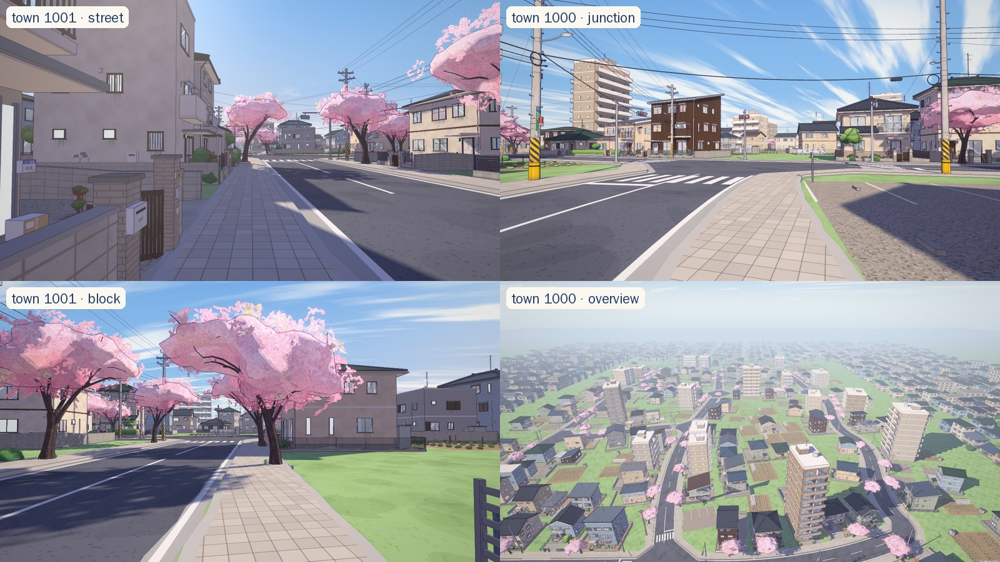

# KeiView — KeiSim の街をアニメ調で歩く

KeiSim の手続き生成の街（道路網・交差点・信号・建物の区画・街路樹）を、
[Sakuragaoka Station](https://github.com/Kenton-GMI/sakuragaoka-station)（MIT）の
**家の生成器**と**セル調（三渲二）レンダラ**で描く three.js ビューアです。ビルド不要、外部アセットなし。



## 仕組み

```
KeiSim Town(seed)  ──scripts/export_town.py──▶  web/towns/town_<seed>.json  ──▶  web/ (three.js)
  道路中心線・交差点ポリゴン              道路 / 歩道の輪郭（ラスタ化して結合）       アスファルト・縁石付き歩道・白線・横断歩道
  白線・横断歩道・停止線                   建物ごとの接道・側・セットバック             ↳ 各建物 = 区画 → Sakuragaoka の家の生成器
  信号（位置・現示・周期）                  追加の区画（すき間・二列目・街区の内側）      ↳ 高い建物 = 4〜10 階のマンション
  建物の箱・街路樹                                                                    ↳ 街路樹 = 桜の生成器、信号 = KeiSim と同じ現示
                                                                                      ↳ 電柱と電線（引込線は家の壁に raycast）
```

* **道路は KeiSim と完全に一致**します。歩道・車道の形は KeiSim 自身のポリゴン（`maptex.py` と同じ重ね順）をラスタ化して輪郭を取り直したもので、ブラウザ側でポリゴン演算をせずに縁石付きの歩道を押し出せます。
* **建物は KeiSim の箱をそのまま「区画」として使います。** 箱の向き・接している道路・セットバックを復元し、区画の前面を歩道の外縁に合わせて Sakuragaoka の `buildLot()`（間取り、階数、玄関、ベランダ、洗濯物、塀、庭…）に渡します。16 m 以上の箱は `mansion.js` のマンションになります（42 m までを 4〜10 階に圧縮）。
* **KeiSim が空けている場所**（建物のすき間、二列目、街区の内側）は、エクスポート時に追加の区画で埋めます（家・畑・月極駐車場・空き地・小さな公園）。すべて道路外なので、KeiSim のシミュレーションには影響しません。
* **信号の灯火は KeiSim と同じ式**（`Junction.signal_state`）で時刻 t から決まります。
* 街の外側は Sakuragaoka の遠景の家並み（`houses/far.js`）で囲みます。
* すべての乱数はシード付きです。同じ `town` なら毎回同じ街になります。

## 使い方

```bash
uv run scripts/export_town.py --town 1000 1001 1002 1003     # web/towns/ に出力（サンプル 4 つは同梱）
cd web && node tools/serve.mjs                               # → http://localhost:5174/?town=1000
```

任意の静的サーバで動きます（ES modules なので `file://` 不可）。three.js とフォントは jsDelivr / Google Fonts から読み込みます。
`npm install` しておくと、`serve.mjs` と `shot.mjs` は `node_modules` の three.js を使います（オフラインや CDN が塞がれた環境向け）。

| 操作 | |
|---|---|
| マウス / WASD / Shift / Space | 視点 / 歩く / 走る / ジャンプ |
| F | 飛行モード |
| 1〜5 | 視点プリセット（通り・交差点・俯瞰・街区・遠くの交差点） |
| R / H | 最初の視点に戻る / UI を隠す |

URL パラメータ: `?town=1001`、`?view=3`、`?t=20`（シミュレーション時刻 → 信号の現示）、`?q=medium`、`?only=roads,houses`、`?stats`、`?fly`

## 開発ツール

```bash
cd web && npm install                         # three + puppeteer-core（ツール用のみ）
node tools/check.mjs --town 1000              # GPU なしのビルド検査（モジュールごとのエラー・ポリゴン数・時間）
node tools/shot.mjs --town 1000 --views 1,2,3 --out shots/t1000     # 実レンダラでスクリーンショット
```

`shot.mjs` は Linux では SwiftShader（CPU 描画）を使うので、GPU のないクラウドコンテナでも動きます（4 コアで準備に約 30 秒、`--q medium` で 1 枚あたり約 20〜30 秒）。
Windows / macOS では GPU を使います。ブラウザは `$CHROME`、Playwright の Chromium、Edge、Chrome の順に探します。

## KeiSim のカメラとして使う（エゴモード）

`?ego=1` を付けると、アニメーションループを回さず、KeiSim の自車カメラ 1 フレームを要求に応じて描画するモードになります。
KeiPilot の学習データ収集とクローズドループ評価で使います（学習の手順と結果は [../README.md](../README.md) の 6 章）。

- `src/ego.js` の `window.__ego(req)` は、カメラ・時刻・周囲の車と歩行者を受け取り、RGB 画像と **ピクセル単位で正確なセマンティックラベル** を返します。ラベルは KeiSim と同じ 13 クラスです。
  - 静的メッシュはバッチング前に `userData.sem` でクラスを付けます（`vendor/.../batch2.js` はクラスごとに別々にまとめます）。
  - ラベル画像は、マテリアルをクラス色に差し替えた 2 回目の描画で作ります。
- `src/world/actors.js` は KeiSim の車（セダン・軽・バン・トラック、ブレーキランプ付き）と歩行者を同じセル調で描きます。
- `tools/ego_server.mjs` は headless Chrome を GPU で動かし、標準入出力の JSON 行で Python（`keisim/render/keiview.py`）とやり取りします。
  - RTX 3060 では、ラベル込みで 1 フレーム約 17 ms、RGB のみで約 12 ms です。
  - 街の読み込みは約 8 秒です。
- エゴモードでは信号の灯器を 2.2 倍で描きます（`?sigscale=` で変更可）。
  - 実寸（灯火 30 cm）だと、320×160 の画像では 30 m 先の灯火が 1〜2 ピクセルになり、見えないフレームが多いためです。
  - 1.6 倍でも、広い交差点の向こう側の灯火は 3 ピクセルしかなく、読み取れませんでした。
  - KeiSim 側の描画も同じ理由で灯火を誇張しています。
- 灯火には向きがあります（実物のひさしと LED と同じ）。
  - 正面から 30° までは明るく、60° より横からは消灯と同じに見えます。
  - ラベル画像でも、45° より横からの灯火は「点灯」に数えません。
  - 消灯中の灯火は、昼間の実物と同じくほぼ黒です。
- 太陽の向き・露出・霞はエピソードごとにランダムです。乱数は KeiSim とは別系列なので、同じシードなら KeiSim で描いたときと同じエピソードになります。

```bash
cd web && npm install && cd ..
uv run scripts/demo.py --agent model --ckpt runs/keipilot.pt --renderer keiview --town 1001 --episode 3 --out runs/demo_kv.mp4   # Release v0.5.0 の重み
```

## ブラウザで KeiPilot を走らせる（パイロットモード）

`?pilot=1` を付けると、運転モデル KeiPilot がブラウザの中で車を運転します（Python も GPU サーバも不要）。
公開版: <https://southern-star.github.io/keisim/?pilot=1>

```bash
uv run --with onnx --with onnxruntime scripts/export_onnx.py runs/keipilot_v5/last.pt web/models/keipilot.onnx
#   （または Release v0.5.0 の keipilot.onnx を web/models/ に置く）
cd web && node tools/serve.mjs                    # → http://localhost:5174/?pilot=1&town=1000
```

- KeiSim の閉ループをそのまま JavaScript に移しています。
  - 毎秒 10 回、自車カメラをエゴモードと同じ 320×160 で描きます（表示用の高解像度の描画とは別のパイプライン）。
  - モデル（`scripts/export_onnx.py` で ONNX にしたもの）がその画像から経路と目標速度を出します。実行は [onnxruntime-web](https://onnxruntime.ai/) で、WebGPU があれば GPU、なければ WASM（Worker の中で実行し、描画は止めません）です。
  - 車は KeiSim と同じ制御器（Pure Pursuit と PI 速度制御、`keisim/control.py`）と車両モデル（`keisim/vehicle.py`、20 Hz）で走ります。
  - 安全層 BrakeHold / RedHold も `keipilot/agent.py` と同じものが入っています。
  - ルートとモデルへの 2 つの入力（次の信号交差点で曲がる方向と、その交差点を出て 4 m 先の目標点）は、`src/nav.js` が `keisim/route.py` と同じ規則で作ります。
- 曲がる方向はキー ← ↑ →（または画面のボタン）で、次の交差点について指定します。
  - 指定しなければランダムに曲がります。
  - Space で一時停止、R で最初からです。
- 画面の線の意味:
  - ピンクはモデルが描いた走行経路です。
  - 水色はナビのルートです。
  - 右下に、モデルへの入力画像とモデルの領域分割を表示します。
- 信号は KeiSim と同じ現示で切り替わります。ほかの車と歩行者はいません。
- ルートから 6 m 外れるか、90 秒動けないと、最初からやり直します（KeiSim の打ち切り条件と同じ）。
- 推論 1 回の時間:
  - WebGPU（RTX 3060）は約 20〜40 ms です。
  - WASM（1 スレッド）は約 0.2〜0.35 秒です。WASM でも閉ループは回りますが、計画の更新が遅れるぶん反応が遅くなります。
- モデルの重みは float16 で保存し、グラフの中で float32 に戻します（30 MB、計算は float32）。値は Release の重みと同じです。

URL パラメータ: `?town=1001`、`?q=low`（表示の画質。モデルの入力は常に medium）、`?ep=wasm` / `?ep=webgpu`（推論エンジンを固定）、`?model=<URL>`

```bash
node tools/pilot_check.mjs --town 1000 --sec 60   # headless Chrome で 60 秒（シミュレーション時間）走らせて記録を表示
node tools/pilot_check.mjs --url https://southern-star.github.io/keisim/ --sec 10   # 公開版を確かめる
```

`pilot_check.mjs` は、モデルの計算を毎ステップ待つので、KeiSim と同じく推論の遅れがない状態で走ります。
Linux では Vulkan を使い、GPU の WebGPU で推論します。フラグなしの headless Chrome の WebGPU は SwiftShader（CPU）で、1 回 6 秒かかります。
ページ側も、SwiftShader の WebGPU しかないブラウザでは WASM を使います。

## 構成

```
index.html, src/main.js     ブートストラップ（レンダラ・空・モジュール構築・バッチング・ループ・HUD・撮影用フック）
src/town.js                 KeiSim → three.js 座標変換、路面グリッド（歩道の高さ・道路までの距離）、視点プリセット
src/world/ground.js         地面
src/world/roads.js          車道・側溝・縁石付き歩道・白線・横断歩道
src/world/houses.js         KeiSim の建物と追加区画 → 家 / マンション / 畑など（Sakuragaoka の家キットを使用）
src/world/mansion.js        マンション生成器
src/world/plots.js          畑・月極駐車場・空き地・公園
src/world/trees.js          街路樹 → 桜
src/world/signals.js        信号機（灯火は KeiSim の現示どおり）
src/world/poles.js          電柱・電線・引込線・支線
src/world/actors.js         KeiSim の車と歩行者（エゴモード）
src/ego.js                  エゴモード（1 フレーム描画・セマンティックラベル・ライティングのランダム化）
src/pilot.js                パイロットモード（モデルの入力の描画、onnxruntime-web、制御器と車両モデル、安全層、表示）
src/nav.js                  パイロットモードのルート、コマンド、目標点（keisim/route.py と同じ規則）
vendor/sakuragaoka/         Sakuragaoka Station から持ってきたコード（MIT、変更点は NOTICE.md）
towns/                      エクスポート済みの街（1000〜1003）。エゴモードの街は .towns/ に自動で出力（git 対象外）
tools/                      serve / check / shot / ego_server / pilot_check
```

## クレジット

レンダラ、マテリアル、家・桜・電柱の生成器は [Sakuragaoka Station](https://github.com/Kenton-GMI/sakuragaoka-station)
（MIT, © 2026 Sakuragaoka Station contributors）によるものです。持ってきたファイルと変更点は
[vendor/sakuragaoka/NOTICE.md](vendor/sakuragaoka/NOTICE.md) を参照してください。
