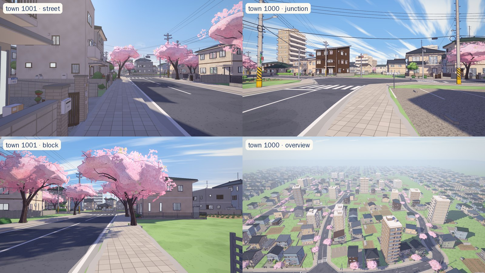
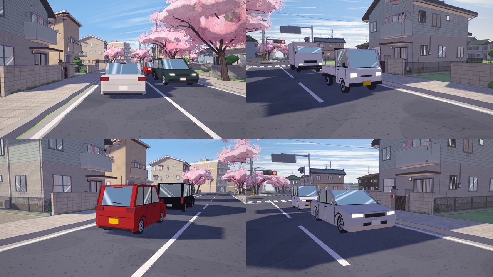

# KeiView — KeiSim の街をアニメ調で歩く

KeiSim の手続き生成の街（道路網・交差点・信号・建物の区画・街路樹）を、
[Sakuragaoka Station](https://github.com/Kenton-GMI/sakuragaoka-station)（MIT）の
**家の生成器**と**セル調（三渲二）レンダラ**で描く three.js ビューアです。ビルド不要、外部アセットなし。



## 仕組み

```
KeiSim Town(seed)  ──scripts/export_town.py──▶  web/towns/town_<seed>.json  ──▶  web/ (three.js)
  道路中心線・交差点ポリゴン              道路 / 歩道の輪郭（ラスタ化して結合）       アスファルト・縁石付き歩道・白線・横断歩道
  白線・横断歩道・停止線                   建物ごとの接道・側・セットバック             ↳ 各建物 = 区画 → Sakuragaoka の家の生成器
  信号（位置・現示・周期）                  追加の区画（すき間・二列目・街区の内側）      ↳ 高い建物 = 4〜10 階のマンション
  建物の箱・街路樹                                                                    ↳ 街路樹 = 桜の生成器、信号 = KeiSim と同じ現示
                                                                                      ↳ 電柱と電線（引込線は家の壁に raycast）
```

* **道路は KeiSim と完全に一致**します。歩道・車道の形は KeiSim 自身のポリゴン（`maptex.py` と同じ重ね順）をラスタ化して輪郭を取り直したもので、ブラウザ側でポリゴン演算をせずに縁石付きの歩道を押し出せます。
* **建物は KeiSim の箱をそのまま「区画」として使います。** 箱の向き・接している道路・セットバックを復元し、区画の前面を歩道の外縁に合わせて Sakuragaoka の `buildLot()`（間取り、階数、玄関、ベランダ、洗濯物、塀、庭…）に渡します。16 m 以上の箱は `mansion.js` のマンションになります（42 m までを 4〜10 階に圧縮）。
* **KeiSim が空けている場所**（建物のすき間、二列目、街区の内側）は、エクスポート時に追加の区画で埋めます（家・畑・月極駐車場・空き地・小さな公園）。すべて道路外なので、KeiSim のシミュレーションには影響しません。
* **信号の灯火は KeiSim と同じ式**（`Junction.signal_state`）で時刻 t から決まります。
* 街の外側は Sakuragaoka の遠景の家並み（`houses/far.js`）で囲みます。
* すべての乱数はシード付きです。同じ `town` なら毎回同じ街になります。

## 使い方

```bash
uv run scripts/export_town.py --town 1000 1001 1002 1003     # web/towns/ に出力（サンプル 4 つは同梱）
uv run scripts/export_town.py --town 1015 1018 --style twophase   # 二段階の信号の町 → town_1015-98782ab7.json など（同梱）
uv run scripts/export_town.py --town 2000 2002 --style ramps      # 片側2車線とランプの町 → town_2000-8c5d282b.json など（同梱）
uv run scripts/import_osm.py --name osm_sapporo --out web/towns     # 実在の町（札幌、OpenStreetMap）→ town_osm_sapporo.json（同梱、data/osm/ の抜き出しから）
uv run scripts/export_town.py --curve                         # カーブの試験コース 10 種類と弱点の試験コース 2 種類 → town_curve_*.json（同梱）
cd web && node tools/serve.mjs                               # → http://localhost:5174/?town=1000
```

カーブの試験コース（`keisim/curve_course.py`、[../README.md](../README.md) 2 章の「カーブの試験コース」）も、町のメニューの「カーブの試験コース」「弱点の試験コース」から開けます。
交差点のない 1 本道で、歩くモードは道の端から、道に沿う向きで始まります。

* `?town=curve_<種類>_v3`: `lines`（白線あり）、`edge`（外側線だけ）、`nolines`（白線なし）、`nolines_guard`（白線なし・ガードレール）、`lines_guard`（白線・ガードレール）。建物なしは `<種類>_nobld`（例 `?town=curve_nolines_guard_nobld_v3`）。
* `?town=curve_weak_w1`（白線なし）、`?town=curve_weak_lines_w1`（白線あり）: 弱点の試験コース。
* `?pilot=1` を付けると、KeiPilot がブラウザの中でコースを走ります。

任意の静的サーバで動きます（ES modules なので `file://` 不可）。three.js とフォントは jsDelivr / Google Fonts から読み込みます。
`npm install` しておくと、`serve.mjs` と `shot.mjs` は `node_modules` の three.js を使います（オフラインや CDN が塞がれた環境向け）。

| 操作 | |
|---|---|
| マウス / WASD / Shift / Space | 視点 / 歩く / 走る / ジャンプ |
| F | 飛行モード |
| 1〜5 | 視点プリセット（通り・交差点・俯瞰・街区・遠くの交差点） |
| R / H | 最初の視点に戻る / UI を隠す |

URL パラメータ: `?town=1001`、`?view=3`、`?t=20`（シミュレーション時刻 → 信号の現示）、`?q=medium`、`?roads=detail`（路面の作り込み、下）、`?only=roads,houses`、`?stats`、`?fly`、`?tdir=.towns`（KeiSim が書き出した街のフォルダ）

## 路面の作り込み（`?roads=detail`）

`src/world/roaddeco.js` が、`roads.js` の路面の上に次のものを足します。画面右上のメニュー「路面: 作り込み」でも切り替えられます。

- 路面標示: 信号のある交差点の停止線の 30 m と 50 m 手前の◇（横断歩道あり）、道路の始まりの黄色の最高速度（規制標示、道路の制限速度を 10 km/h 単位に丸めたもの）、歩道のある道路の青い矢羽根（自転車の通行位置）
- 舗装: 信号のある交差点の 35 % を赤茶色のカラー舗装に。生活道路（道路の種類）の半分は路側帯を緑に（通学路）
- 路面のふた: 道路の中央付近のマンホール（亀甲模様・桜のデザイン・同心円の 3 種）、消火栓（黄色の縁取り）、仕切弁とガスの小さなふた、側溝のグレーチング
- 補修跡: 打ち換えた舗装・横断する掘削跡・ひび割れのシール
- 歩道: 横断歩道の端の点状ブロックと、そこから歩道に沿う線状ブロック、縁石沿いのガードパイプ
- 道路の付属物: カーブ（2 本の道路だけがつながる角）の外側のカーブミラー、最高速度・横断歩道・駐車禁止の標識

配置はすべて街のデータから決まり、乱数はシード付きです（同じ街なら毎回同じ）。道路の形は変えず、車線の上に立つものも置きません。
既定（`plain`）ではこのモジュールを読み込まないので、今までの見た目と 1 ピクセルも変わりません。
これまでの KeiView の学習データと評価画像はすべて `plain` です。学習済みのモデルを `detail` で走らせると、モデルにとっては初めて見る絵になります。

エゴモードのセマンティックラベルは、路面標示が marking、ふた・補修跡・カラー舗装が road、点字ブロックが sidewalk、ガードパイプ・標識・カーブミラーが pole です。

## 道路の種類

KeiSim の roadtypes の街（`--town_style roadtypes`、[../README.md](../README.md) の 3 章）では、道路ごとに幅・歩道・白線が違います。
エクスポートは道路ごとの断面（`kind`、車線幅、路側帯、歩道の幅、制限速度）と黄色のセンターライン（`markings_yellow`）を足します。
ビューアは、歩道のない道路では電柱を道路のすぐ外に、視点プリセットを路側帯に置きます。

```bash
uv run scripts/export_town.py --town 1000 --style roadtypes     # web/towns/town_1000-<設定のハッシュ>.json（1000 は同梱）
```

## 開発ツール

```bash
cd web && npm install                         # three + puppeteer-core（ツール用のみ）
node tools/check.mjs --town 1000              # GPU なしのビルド検査（モジュールごとのエラー・ポリゴン数・時間、道路の上の電柱）
node tools/check.mjs --town 1000 ground roads houses trees signals poles roaddeco   # 路面の作り込みも
node tools/shot.mjs --town 1000 --views 1,2,3 --out shots/t1000     # 実レンダラでスクリーンショット（--roads detail、--tdir .towns も可）
```

`shot.mjs` は Linux では SwiftShader（CPU 描画）を使うので、GPU のないクラウドコンテナでも動きます（4 コアで準備に約 30 秒、`--q medium` で 1 枚あたり約 20〜30 秒）。
Windows / macOS では GPU を使います。ブラウザは `$CHROME`、Playwright の Chromium、Edge、Chrome の順に探します。

## KeiSim のカメラとして使う（エゴモード）

`?ego=1` を付けると、アニメーションループを回さず、KeiSim の自車カメラ 1 フレームを要求に応じて描画するモードになります。
KeiPilot の学習データ収集とクローズドループ評価で使います（学習の手順と結果は [../README.md](../README.md) の 6 章）。

- `src/ego.js` の `window.__ego(req)` は、カメラ・時刻・周囲の車と歩行者を受け取り、RGB 画像と **ピクセル単位で正確なセマンティックラベル** を返します。ラベルは KeiSim と同じ 13 クラスです。
  - 静的メッシュはバッチング前に `userData.sem` でクラスを付けます（`vendor/.../batch2.js` はクラスごとに別々にまとめます）。
  - ラベル画像は、マテリアルをクラス色に差し替えた 2 回目の描画で作ります。
- `src/world/actors.js` は KeiSim の車（セダン・軽・バン・トラック、ブレーキランプ付き）と歩行者を同じセル調で描きます。
  - 学習と評価のフレームは、この簡易な形の車で描きます。パイロットモードの表示に使う詳しい形の車（`src/world/cars.js`）は、`?cardetail=1` を付けたときだけ描きます。
- `tools/ego_server.mjs` は headless Chrome を GPU で動かし、標準入出力の JSON 行で Python（`keisim/render/keiview.py`）とやり取りします。
  - RTX 3060 では、ラベル込みで 1 フレーム約 17 ms、RGB のみで約 12 ms です。
  - 街の読み込みは約 8 秒です。
  - `--gl auto`（既定）は、GPU で WebGL2 が使えなければ SwiftShader（CPU 描画）に自動で切り替えます。`--gl hw` / `--gl soft` で固定もできます（Python 側は `EnvConfig.keiview_gl`）。
  - `--roads detail` で路面の作り込みを足して描きます（Python 側は `EnvConfig.keiview_roads`、スクリプトは `--keiview_roads detail`）。既定は `plain` です。
  - SwiftShader では 1 フレーム約 2 秒です（4 vCPU のクラウド VM で計測。並列にしてもほぼ伸びません）。動作確認やデモ動画 1 本向けです。
- エゴモードでは信号の灯器を 2.2 倍で描きます（`?sigscale=` で変更可）。
  - 実寸（灯火 30 cm）だと、320×160 の画像では 30 m 先の灯火が 1〜2 ピクセルになり、見えないフレームが多いためです。
  - 1.6 倍でも、広い交差点の向こう側の灯火は 3 ピクセルしかなく、読み取れませんでした。
  - KeiSim 側の描画も同じ理由で灯火を誇張しています。
- 灯火には向きがあります（実物のひさしと LED と同じ）。
  - 正面から 30° までは明るく、60° より横からは消灯と同じに見えます。
  - ラベル画像でも、45° より横からの灯火は「点灯」に数えません。
  - 消灯中の灯火は、昼間の実物と同じくほぼ黒です。
- 太陽の向き・露出・霞はエピソードごとにランダムです。乱数は KeiSim とは別系列なので、同じシードなら KeiSim で描いたときと同じエピソードになります。

```bash
cd web && npm install && cd ..
uv run scripts/demo.py --agent model --ckpt runs/keipilot.pt --renderer keiview --town 1001 --episode 3 --out runs/demo_kv.mp4   # Release v0.10.0 の重み
```

## ブラウザで KeiPilot を走らせる（パイロットモード）

`?pilot=1` を付けると、運転モデル KeiPilot がブラウザの中で車を運転します（Python も GPU サーバも不要）。
公開版: <https://southern-star.github.io/keisim/?pilot=1>

```bash
uv run --with onnx --with onnxruntime scripts/export_onnx.py runs/keipilot_v24/last.pt web/models/keipilot.onnx
#   （または Release v0.10.0 の keipilot.onnx を web/models/ に置く）
cd web && node tools/serve.mjs                    # → http://localhost:5174/?pilot=1&town=1000
```

- KeiSim の閉ループをそのまま JavaScript に移しています。
  - 毎秒 10 回、自車カメラをエゴモードと同じ 320×160 で描きます（表示用の高解像度の描画とは別のパイプライン）。
  - モデル（`scripts/export_onnx.py` で ONNX にしたもの）がその画像から経路と目標速度を出します。実行は [onnxruntime-web](https://onnxruntime.ai/) で、WebGPU があれば GPU、なければ WASM（Worker の中で実行し、描画は止めません）です。
  - 車は KeiSim と同じ制御器（Pure Pursuit と PI 速度制御、`keisim/control.py`）と車両モデル（`keisim/vehicle.py`、20 Hz）で走ります。
  - 安全層 BrakeHold / RedHold も `keipilot/agent.py` と同じものが入っています。
  - ルートとモデルへの 2 つの入力（次の信号交差点で曲がる方向と、その交差点を出て 4 m 先の目標点）は、`src/nav.js` が `keisim/route.py` と同じ規則で作ります。
  - v0.10 のモデルには、最後に止まってから走った距離（10 m で頭打ち）も入れます。止まれの線の手前で「まだ止まっていない」のか「止まったあとで発進した」のかは、1 枚の画像では分からないためです。`src/pilot.js` が `keipilot/data.py` の `stand_update` と同じく制御のたびに数えます（ONNX に `stand` 入力があるときだけ。前の版のモデルもそのまま動きます）。
- 曲がる方向はキー ← ↑ →（または画面のボタン）で、次の交差点について指定します。
  - 指定しなければランダムに曲がります。
  - Space で一時停止、R で最初から、T で周りの車の表示を切り替えます。
- 画面の線の意味:
  - ピンクはモデルが描いた走行経路です。
  - 水色はナビのルートです。
  - 右下に、モデルへの入力画像とモデルの領域分割を表示します。
- 信号は KeiSim と同じ現示で切り替わります。
  - town 1000〜1003 は、流入方向ごとに 1 方向ずつ青になるスプリット現示です。交差点の中で進路が交わらないので、右折待ちはありません。
  - town 1015 と 1018（`?town=1015-98782ab7`、`?town=1018-98782ab7`、右上のメニューでも選べます）は、日本でふつうの二段階の信号です。向かい合う方向が同時に青になり、右折は交差点の中の待ち位置で対向車の切れ目を待ちます（long3 と同じ街のタイプ）。KeiPilot は v0.6 からこの右折待ちを学んでいます。
- 周りの車（`src/traffic.js`）が街を走ります。歩行者はいません。
  - 台数は車線の長さに合わせて決めます（車線 1 km あたり 12 台、最大 40 台。town 1000 では 28 台）。
  - 動きは `keisim/traffic.py` の NPC を軽くしたものです。交差点ごとにランダムに曲がり、IDM で前の車（と自車）との車間を取り、赤と黄色で止まります（黄色は止まれるときだけ）。交差点の中に別の現示の車がいるときと、出口が詰まっているときは、停止線で待ちます。
  - 二段階の信号の町では、KeiSim と同じ右折のルールで動きます。
  - 実在の町「札幌」（`?town=osm_sapporo`、[../README.md](../README.md) 2 章の「実在の町」）では、信号のない交差点で KeiSim と同じ優先道路の規則で動きます（細い道から来た車が優先道路のすべての動きに譲る、右折は対向の左折を先に行かせる、車は 6 m まで）。細い道の入口には止まれの標識と停止線があり、周りの車はそこで一度止まってから譲ります。地図データは © OpenStreetMap contributors (ODbL) で、画面の右下に出典を出します。
    - 進路が交わる・合流する動きは、直進 > 左折 > 右折 の順に優先します。
    - 同じ向きの動きどうしが交わるとき（斜めの交差点の右折どうし）は、片方が譲ります。決め方も KeiSim と同じです（`Town._equal_gives_way`）。
      town 1015 と 1018 にはこの交差はありません。
    - 右折は待ち位置で、優先の車（自車も含む）が 5 秒以内に交わる所に来るあいだは待ちます。
    - 待ち位置と、譲る相手は、KeiSim の `Town._make_yields` と同じ手順で JavaScript で求めます。town 1015 では、KeiSim と同じ 14 本の右折が譲り、待ち位置の差は 0.25 m 以内です。
  - 片側2車線とランプの町（下）では、周りの車も車線を変え、ランプを使います。
  - 自車のカメラに見えない所で 40 秒以上止まっている車は、別の場所に移します。
  - 自車と車体が重なると「接触」として数え、HUD に表示します。
  - 描画が重いときは、画面の「周りの車」ボタンか T キーで消せます（選んだ設定はブラウザに残ります）。`?traffic=0` でも消せます。周りの車の描画は、1 台を材質ごとに 1 つのメッシュにまとめて軽くしています（車 24 台が見えているとき、描画命令は 520 → 740、RTX 3060・1280×720 で 1 フレームあたり 2〜3 ms 増）。
- カメラから 70 m 以内の周りの車は、詳しい形のモデル（`src/world/cars.js`）で描きます。
  - 車種は KeiSim が決めた車の大きさで選びます。軽ハイトワゴン、軽ハッチ、軽トラ（白い軽に多い）、コンパクト、セダン、SUV、ミニバン、小型トラックの 8 種類です。
  - 車体は、横から見た輪郭を車幅の方向に押し出して角を丸めたものです。暗い色ガラス、窓枠とピラー、ドアの継ぎ目とノブ、ホイール、ブレーキで光るテールランプ（ハイマウントも）、ナンバー（軽は黄色）を付けています。
  - モデルへの入力（320×160）は、学習のときと同じ簡易な形の車で描きます。表示の車を変えても、モデルの入力は変わりません。
  - 1 台は 1,400〜2,300 ポリゴンで、これも材質ごとに 1 つのメッシュにまとめています。簡易な形と比べて、描画命令は数個増えるだけで、描画時間の差は測れないほどです（RTX 3060・1280×720）。
  - `?cardetail=0` で、表示も簡易な形の車に戻せます。

  
- **片側2車線とランプの町**: town 2000 と 2002（`?town=2000-8c5d282b`、`?town=2002-8c5d282b`、メニューの「片側2車線とランプ」）は KeiSim の ramps の街（[../README.md](../README.md) 3 章の郊外の街と平面の左折ランプ）です。
  - 幹線道路は片側2車線、信号は二段階、道路の種類（幹線・通常・生活道路・路地）があります。
  - 車線は JavaScript で作り直さず、KeiSim の車線をそのまま使います（エクスポートの `lane_graph`: 車線・隣の車線・ランプのつながり・交差点の接続・譲り合いの表・信号の現示）。共通の部分は `src/lanes.js` です。
  - ナビのルート（`src/nav.js`）は、KeiSim の `route.lane_moves` / `pick_move` と同じく、次の交差点での動きを道路のどの車線のものからも選び、今の車線になければ隣の車線へ移ります（5 次曲線、40 m）。
    ランプのある交差点の左折は、手前で分かれるランプ（減速車線 → カーブ → 加速車線から合流）を通ります。HUD は「左折（ランプ）」、車線変更は「車線変更 あと ○ m」と出ます。
    ← ↑ → で曲がる方向を変えると、必要なら車線変更を入れてルートを作り直します（今いる道路の上でも、変更がまだ間に合えば）。
  - この町では、ランプの手前 120 m から走り始めます（`?ramp=1` で 2 本目のランプ、`?ramp=-1` でふつうの出発点）。
  - 電柱はふつう歩道の外側の端に立てますが、ランプの横ではそこがランプの車線になるので、外へずらしてランプの外側の歩道に立てます（town 2000 で 9 本、2002 で 5 本）。
    道路の上かどうかは、エクスポートの路面の多角形で確かめます（`T.onRoad`、`src/town.js`）。`tools/check.mjs` は、道路の上に電柱があると失敗します。
  - 周りの車（`src/traffic.js`）は `keisim/traffic.py` の車線変更をそのまま移しています。移り始める 12 m（またはその速度で止まれる距離）手前から、移る先の車線の前後の余裕（車間 2 m + 後ろの車の速さ × 0.8 s + 近づく速さ × 1.5 s、`route.change_room`、自車も含む）を確かめ、なければ移り始めを先へずらし、範囲の終わりでは止まって待ちます。
    待っている車には、移る先の車線の後ろの車が間を空けます（ファスナー合流）。移り始めた車には、後ろの車がついて行きます。8 秒待っても入れなければ今の車線のまま進みます（ランプの上は行き止まりなので、入れるまで待ちます）。
  - 道路ごとの制限速度、細い道のカーブの 1 台ずつの通行（KeiSim の譲り合いの表をそのまま使います）も KeiSim と同じです。
    トラックは KeiSim の路地（車線 3.0 m 未満）だけでなく生活道路（3.0 m）にも、ほかに道がない所を除いて入りません。車体を経路に沿った箱で描くので、7 m のトラックが細い道との急なカーブで中央線を越えて、反対の車線で待つ車に重なるためです。
  - モデルは車線変更とランプを学習していません（ゼロショット）。KeiSim の ramp_routes スイートでは v0.10 は 30/30 完走しましたが、分流・合流での横ずれは大きめです（[../README.md](../README.md)）。
    ブラウザでも同じです。town 2000 のランプ 0 から 40 秒（`pilot_check.mjs --only ground,roads,signals,actors`、WASM）では、やり直しも接触もなくランプを抜けましたが、
    分流の手前で早めに減速車線へ移り（ルートとの差 最大 3.7 m）、合流では加速車線に残り、その先の右折の前の車線変更にはついて行かず、左の車線から右折しました。
    周りの車はこの 40 秒に 6 回車線を変えました。
  - `node tools/traffic_check.mjs --town 2000-8c5d282b --sec 600 --cars 80 --ego 0`: ブラウザなしで周りの車だけを動かす検査です（node だけ）。town 2000 と 2002 で、40 台・80 台を各 5 シード 600 秒動かして、車どうしの接触は 0 回、車線変更は 1 回の検査あたり 62〜158 回、ランプの通過は 3〜17 回でした。60 秒以上止まったままの車もありません。
    今までの町（1000、1015、札幌、西大井）の周りの車とナビのルートは、この変更の前と 1 ビットも変わらないことを、この検査の記録で確かめました。
- ルートから 6 m 外れるか、90 秒動けないと、最初からやり直します（KeiSim の打ち切り条件と同じ）。
- 推論 1 回の時間:
  - WebGPU（RTX 3060）は約 20〜40 ms です。
  - WASM（1 スレッド）は約 0.2〜0.35 秒です。WASM でも閉ループは回りますが、計画の更新が遅れるぶん反応が遅くなります。
- HUD の「KeiPilot」の右に、モデルの速さが出ます。左から、推論エンジン、1 秒あたりの判断（モデルの計算）の回数、推論 1 回の時間、モデルへの入力画像の描画時間です。
  - RTX 3060 の PC で town 1000 を実時間で走らせると、WebGPU では「webgpu · 判断 9.6 回/秒 · 推論 56 ms · 描画 8 ms」でした。
  - WASM では「wasm · 判断 4.5 回/秒 · 推論 210 ms · 描画 7 ms」でした。
- モデルの判断に時間がかかるときは、町が判断を待ちます（`?pace`）。
  - KeiSim は 0.1 秒ごとに、遅れなしで判断します。ブラウザでは、画像を撮ってから判断が届くまでに車が進みます（36 km/h なら 0.1 秒で 1 m）。
  - 判断が遅れると、赤信号のブレーキが停止線に間に合いません。
    CPU コア 1 個に固定した Chrome（WASM、判断 1 回 約 0.5 秒）で town 1000 を実時間 5 分走らせました。待たない場合（`?pace=0`）は、赤信号に近づいた 12 回のうち 6 回、停止線を越えました。
    モデルは、どの回も信号を「赤 100%」と読んでいました。
  - そこで、判断に 0.25 秒より長くかかるときは、町（自車・周りの車・信号）の時間をゆっくり進めて、判断を待ちます。
    同じ条件で 7 分走らせると、赤信号は 10 回とも越えませんでした。7 回は停止線で止まり、3 回は減速しているうちに青になりました。町は平均で実時間の 0.63 倍の速さで進みました。
  - HUD には、町が実時間の何倍で進んでいるかが「スロー ×0.74」のように出ます。
  - WebGPU や速い CPU では判断が 0.25 秒に収まるので、町はふつうの速さで進みます（RTX 3060 の PC では、WASM でも 0.21 秒で ×1.00）。
  - `?pace=0` を付けると、町は判断を待ちません（前の動き）。
- モデルの重みは float16 で保存し、グラフの中で float32 に戻します（30 MB、計算は float32）。値は Release の重みと同じです。

URL パラメータ: `?town=1001`（二段階の信号の町は `?town=1015-98782ab7`、札幌は `?town=osm_sapporo`）、`?q=low`（表示の画質。モデルの入力は常に medium）、`?ep=wasm` / `?ep=webgpu`（推論エンジンを固定）、`?pace=0.25`（モデルの判断に何秒までかかってよいか。それより長くかかるときは町の時間をゆっくり進めて待つ、既定 0.25。`?pace=0` で待たない）、`?model=<URL>`、`?traffic=0`（周りの車なし）、`?cars=20`（周りの車の台数）、`?cardetail=0`（周りの車を簡易な形で表示）、`?tdir=.towns`（`scripts/import_osm.py` が `web/.towns` に書き出した町、例 `?tdir=.towns&town=osm_nishioi`: 一方通行の道路は中心線の上の車線 1 本で、周りの車もその向きにだけ走ります）、`?ramp=N`（ランプのある町: N 本目のランプの手前から。`-1` でふつうの出発点）、`?ort=node_modules/onnxruntime-web/dist/`（onnxruntime-web を CDN ではなくこのサイトから読む。同じサイトの相対パスだけ。CDN に出られない環境のテスト用: `npm install --no-save onnxruntime-web@1.20.1`）

```bash
node tools/pilot_check.mjs --town 1000 --sec 60   # headless Chrome で 60 秒（シミュレーション時間）走らせて記録を表示
node tools/pilot_check.mjs --url https://southern-star.github.io/keisim/ --sec 10   # 公開版を確かめる
node tools/pilot_check.mjs --town osm_sapporo --sec 120 --model models/keipilot_v24.onnx   # 札幌で、別の ONNX（web/ の下）を走らせる
node tools/pilot_check.mjs --town 2000-8c5d282b --sec 60 --ort node_modules/onnxruntime-web/dist/   # ランプの町（CDN なし）
node tools/pilot_check.mjs --town 1000 --ep wasm --realtime 60 --sec 0   # ページのループのまま実時間で 60 秒: fps、判断の回数、推論と描画の時間、町の速さ
node tools/traffic_check.mjs --town 2002-8c5d282b --sec 600 --why   # 周りの車とナビだけを node で（接触の詳細つき）
```

`pilot_check.mjs` は、モデルの計算を毎ステップ待つので、KeiSim と同じく推論の遅れがない状態で走ります（`--realtime` の間だけは、見る人のブラウザと同じく実時間で走ります）。
GPU のない環境（SwiftShader）では町全体（1000 万ポリゴン）の描画に 1 フレーム数秒かかるので、`--only ground,roads,signals,actors`（家・木・電柱なし）で動作を確かめます。
家のない町はモデルにとって見慣れない絵ですが、town 1015 ではルートからのずれは 0.02 m のままでした。
Linux では Vulkan を使い、GPU の WebGPU で推論します。フラグなしの headless Chrome の WebGPU は SwiftShader（CPU）で、1 回 6 秒かかります。
ページ側も、SwiftShader の WebGPU しかないブラウザでは WASM を使います。

## 構成

```
index.html, src/main.js     ブートストラップ（レンダラ・空・モジュール構築・バッチング・ループ・HUD・撮影用フック）
src/town.js                 KeiSim → three.js 座標変換、路面グリッド（歩道の高さ・道路までの距離）、視点プリセット
src/world/ground.js         地面
src/world/roads.js          車道・側溝・縁石付き歩道・白線・横断歩道
src/world/houses.js         KeiSim の建物と追加区画 → 家 / マンション / 畑など（Sakuragaoka の家キットを使用）
src/world/mansion.js        マンション生成器
src/world/plots.js          畑・月極駐車場・空き地・公園
src/world/trees.js          街路樹 → 桜
src/world/signals.js        信号機（灯火は KeiSim の現示どおり）
src/world/poles.js          電柱・電線・引込線・支線
src/world/roaddeco.js       路面の作り込み（?roads=detail）: 路面標示・カラー舗装・ふた・点字ブロック・ガードパイプ・標識
src/world/actors.js         KeiSim の車と歩行者（エゴモード、パイロットモードの周りの車）
src/world/cars.js           表示用の詳しい形の車（8 車種）
src/ego.js                  エゴモード（1 フレーム描画・セマンティックラベル・ライティングのランダム化）
src/pilot.js                パイロットモード（モデルの入力の描画、onnxruntime-web、制御器と車両モデル、安全層、表示）
src/nav.js                  パイロットモードのルート、コマンド、目標点（keisim/route.py と同じ規則）
src/lanes.js                KeiSim の車線グラフ（片側2車線・ランプ）、車線変更、ナビと周りの車のルートの経路
vendor/sakuragaoka/         Sakuragaoka Station から持ってきたコード（MIT、変更点は NOTICE.md）
towns/                      エクスポート済みの街（1000〜1003、二段階の信号の 1015 と 1018、道路の種類の 1000-dae67d73、片側2車線とランプの 2000 と 2002）。エゴモードの街は .towns/ に自動で出力（git 対象外）
tools/                      serve / check / shot / ego_server / pilot_check / traffic_check
```

## クレジット

レンダラ、マテリアル、家・桜・電柱の生成器は [Sakuragaoka Station](https://github.com/Kenton-GMI/sakuragaoka-station)
（MIT, © 2026 Sakuragaoka Station contributors）によるものです。持ってきたファイルと変更点は
[vendor/sakuragaoka/NOTICE.md](vendor/sakuragaoka/NOTICE.md) を参照してください。
